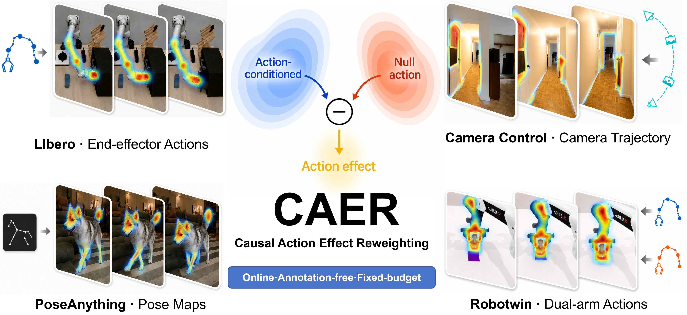

<h1 align="center" style="font-size: 48px;">CAER: Causal Action Effect Reweighting for World Model Training</h1>

[](https://opensource.org/licenses/Apache-2.0)
[](https://manifoldai-research.github.io/CAER/)
[](https://arxiv.org/abs/2608.30897)

CAER is an annotation-free training objective that measures which predicted
future tokens are causally sensitive to an action, then reallocates a fixed
per-sample MSE/flow-matching budget toward those tokens. It is a loss adapter,
not a new architecture, and it works with diffusion, flow-matching, video,
image, and sequence world models that already support a meaningful null action
or dropped-control condition.



## Adapt CAER to your own world model

This repository ships a reusable coding-agent skill at
[`skills/caer-world-model-adapter/SKILL.md`](skills/caer-world-model-adapter/SKILL.md).
After cloning, point an agent at that file with a request such as:

```text
Use skills/caer-world-model-adapter/SKILL.md to adapt CAER to this repository.
First trace the existing target, scheduler, action dropout, masks, and loss
reduction. Then implement matched on-action/null-action diagnostics, detached
per-sample weights, tests, and a one-step optimizer smoke test. Preserve the
original loss exactly when CAER is disabled.
```

The skill tells the agent what to inspect, where the causal pair must be
identical, how to align effect maps with arbitrary token layouts, and which
failure modes must be tested. Read its two references when porting to a new
model; they are intentionally framework-neutral. The four modalities in this
repository are validated examples, not prerequisites or architectural limits.

## CAER in one minute

For the same noisy input and noise level, evaluate the model with the real
action and with its native null action:

```text
P_on   = fθ(x_noisy, t, context, action)
P_null = fθ(x_noisy, t, context, null_action)
S      = ||P_on - P_null||₂  over prediction channels
rho    = stopgrad(S / mean_valid(S))
```

The main prediction remains gradient-bearing. The two diagnostic forwards are
no-grad and differ only in the action condition. The final loss is a
per-sample, masked, weighted squared error:

```text
L = mean_b [ Σ(valid · rho · error²) / max(Σ(valid · rho), ε) ]
```

Zero-effect maps, invalid/padded regions, and action-dropped samples fall back
to uniform weight. This keeps each sample's gradient budget comparable to the
original objective instead of letting batch composition set the scale.

## Public loss names

The command-line vocabulary is deliberately small:

| Name | Meaning |
| --- | --- |
| `MSE` | Original unweighted mean-squared-error baseline. |
| `CAER` | Action-effect weighting. CAP uses normalized effect; LIBERO keeps its validated lower-clamped effect policy. |

Use `CAER` for the method described in the paper. The implementation-specific
policy is selected inside each validated training entry point; users do not
need to know legacy ablation labels.

## Reproduce the included experiments

```bash
python -m venv .venv
source .venv/bin/activate
pip install -U pip
pip install -r sources/cap/requirements.txt   # or sources/libero/requirements.txt

cp config/paths.env.example config/paths.env
# Edit the local model, data, and output paths in config/paths.env.

bash scripts/preflight.sh all
bash scripts/train_libero.sh CAER
bash scripts/train_arm.sh CAER
bash scripts/train_camera.sh CAER
bash scripts/train_poseanything.sh CAER
```

For the matched baseline, replace `CAER` with `MSE`. Validate command construction before spending
GPU time:

```bash
DRY_RUN=1 bash scripts/train_camera.sh CAER
SMOKE=1   bash scripts/train_poseanything.sh CAER
```

The complete data contract, checkpoint resume rules, topology, hyperparameters,
and preflight checks are in [`docs/TRAINING.md`](docs/TRAINING.md).

## Repository layout

```text
.
├── config/paths.env.example       # portable path configuration template
├── skills/caer-world-model-adapter/ # reusable agent skill and references
├── scripts/                       # preflight and public training entry points
├── docs/TRAINING.md               # reproduction and operations guide
└── sources/
    ├── cap/                       # Arm, Camera, and PoseAnything
    └── libero/                    # LIBERO action-conditioned training
```

Machine-specific paths belong in the gitignored `config/paths.env`; do not
hard-code private filesystem locations into scripts or documentation.

## Citation

```bibtex
@article{caer,
  title   = {CAER: Causal Action Effect Reweighting for World Model Training},
  author  = {Jianjie Fang and Xvyuan Liu and Ziyou Wang and Rongze Tang and Zhaolu Wang and Zhuohang Li and Xin Zhang and Haisheng Su and Chen Gao and Wei Wu and Xinlei Chen and Yong Li},
  year    = {2026},
  url     = {https://arxiv.org/abs/2608.30897}
}
```

## License

[Apache License 2.0](LICENSE). Model weights and datasets retain their original
licenses; see [NOTICE](NOTICE).
